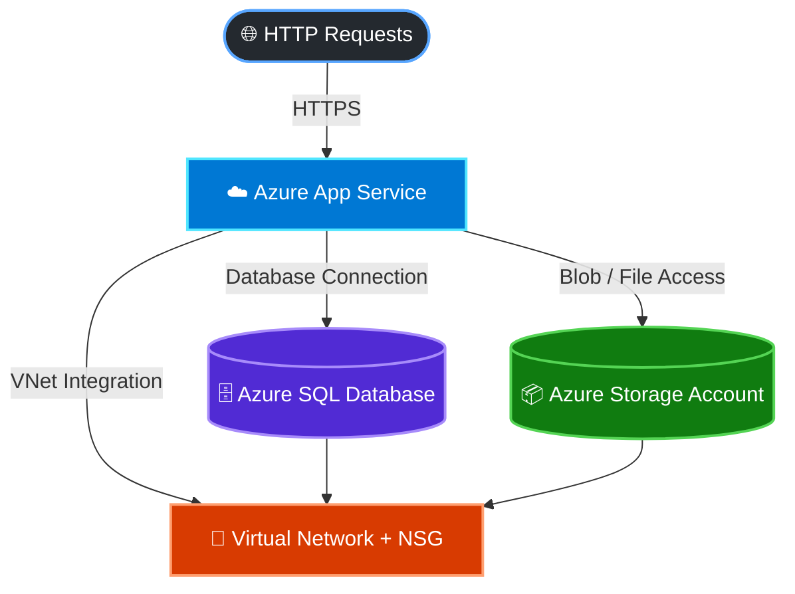

# Azure Deployment Scripts

## Overview
A collection of reusable PowerShell scripts for deploying and configuring Microsoft Azure resources. The repository demonstrates practical experience with Azure infrastructure automation, networking, and DevOps.

## Deployment Scripts
- Deploy Azure resources with annotated scripts:
  - `app-service/` — Azure App Service deployments
  - `networking/` — Virtual Network and NSG configuration
  - `sql/` — Azure SQL Server and Database deployments
  - `storage/` — Azure Storage Account deployments

- The scripts are organized by Azure resource type and can be extended or adapted for different environments.

## Architecture Diagram

## Prerequisites
- [Azure CLI](https://learn.microsoft.com/cli/azure/install-azure-cli) installed
- Active Azure subscription
- Git installed and configured
- Visual Studio Code (recommended)

## Author

**Daisy Viruet-Allen**

Software Developer focused on **.NET, Azure cloud technologies, application modernization, and DevOps automation**.

---
