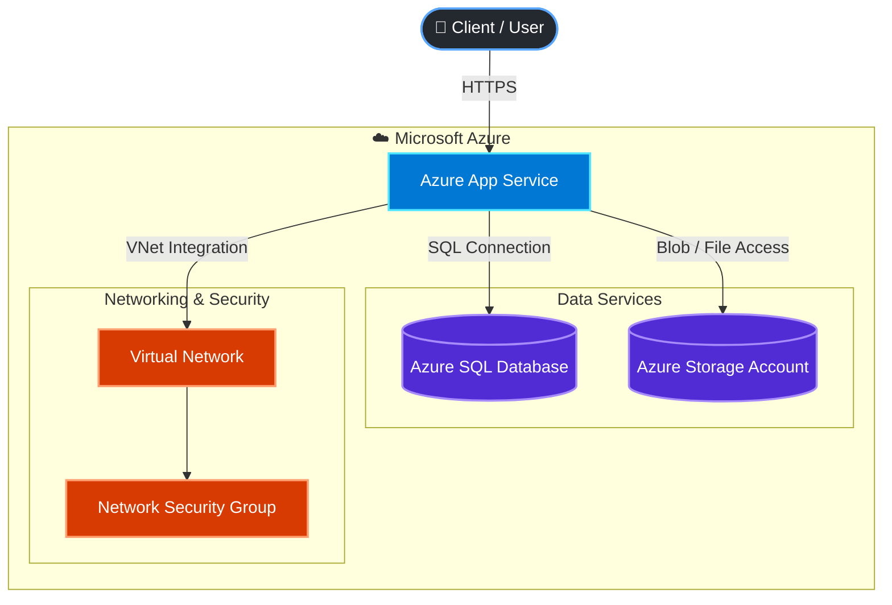
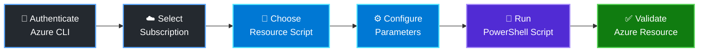

# Azure Deployment Scripts

A collection of reusable PowerShell scripts for deploying, configuring, and managing resources in Microsoft Azure.

This repository demonstrates practical experience with **Azure cloud infrastructure, PowerShell automation, networking, security, and DevOps practices**.

---

## Overview

The goal of this repository is to provide organized and reusable deployment scripts for common Azure resources.

The scripts are organized by resource type so they can be used independently, modified for different environments, and expanded as additional Azure services are introduced.

Current deployment areas include:

- Azure App Service
- Azure SQL Database
- Azure Storage Accounts
- Azure Virtual Networks
- Network Security Groups

---

## Features

- PowerShell-based Azure deployment automation
- Azure CLI integration
- Reusable and organized deployment scripts
- Azure App Service deployment
- Azure SQL Server and Database deployment
- Azure Storage Account provisioning
- Virtual Network and subnet configuration
- Network Security Group configuration
- Environment-specific configuration support
- Modular structure designed for future expansion

---

## Architecture Diagram



The diagram represents a typical Azure application architecture supported by the deployment scripts in this repository.

The application is hosted using **Azure App Service**, communicates with **Azure SQL Database** and **Azure Storage**, and uses Azure networking and security services such as **Virtual Networks** and **Network Security Groups**.

---

## Repository Structure

```text
Azure-Deployment-Scripts/
│
├── app-service/
│   └── PowerShell scripts for deploying and configuring
│       Azure App Services
│
├── networking/
│   └── PowerShell scripts for Virtual Networks,
│       subnets, and Network Security Groups
│
├── sql/
│   └── PowerShell scripts for deploying
│       Azure SQL Server and SQL Databases
│
├── storage/
│   └── PowerShell scripts for creating and configuring
│       Azure Storage Accounts
│
└── README.md
```

Each folder represents a specific Azure resource area, making the repository easier to navigate, maintain, and expand.

---

## Prerequisites

Before using these scripts, make sure the following tools and resources are available:

- [Azure CLI](https://learn.microsoft.com/cli/azure/install-azure-cli)
- Active Microsoft Azure subscription
- PowerShell
- Git
- Visual Studio Code (recommended)

Verify that Azure CLI is installed:

```powershell
az --version
```

---

## Installation

Clone the repository:

```bash
git clone https://github.com/boricua007/Azure-Deployment-Scripts.git
```

Navigate into the repository:

```bash
cd Azure-Deployment-Scripts
```

---

## Azure Authentication

Before running deployment scripts, authenticate with Azure:

```powershell
az login
```

A browser window will open allowing you to authenticate with your Microsoft Azure account.

Verify the currently selected Azure subscription:

```powershell
az account show
```

To view all available subscriptions:

```powershell
az account list --output table
```

If necessary, select the appropriate subscription:

```powershell
az account set --subscription "<subscription-name-or-id>"
```

---

## Example Deployment

Deployment scripts can be executed individually depending on the Azure resource being provisioned.

For example, navigate to the App Service folder:

```powershell
cd app-service
```

Run the appropriate PowerShell deployment script:

```powershell
.\deploy-app-service.ps1
```

> **Note:** Script names, parameters, and configuration requirements may vary by resource. Review each script before execution and modify configuration values as necessary for your Azure environment.

---

## Deployment Workflow

A typical deployment workflow using this repository follows these steps:



### Deployment Process

1. Authenticate with Microsoft Azure.
2. Select the appropriate Azure subscription.
3. Navigate to the resource-specific directory.
4. Review and configure the required parameters.
5. Execute the PowerShell deployment script.
6. Validate the deployed resource in Azure.

---

## Resource Areas

### App Service

The `app-service` directory contains scripts related to deploying and configuring Azure App Services.

Typical automation may include:

- App Service Plans
- Web Apps
- Application configuration
- Deployment settings
- Environment configuration

### SQL

The `sql` directory contains scripts related to Azure SQL resources.

Typical automation may include:

- Azure SQL Servers
- Azure SQL Databases
- Firewall configuration
- Database configuration

### Storage

The `storage` directory contains scripts for Azure Storage resources.

Typical automation may include:

- Storage Accounts
- Blob Storage
- Containers
- Storage configuration
- Access settings

### Networking

The `networking` directory contains scripts for Azure networking and security resources.

Typical automation may include:

- Virtual Networks
- Subnets
- Network Security Groups
- Security rules
- Network configuration

---

## Security Considerations

Sensitive information should **never be committed directly to the repository**.

Avoid storing values such as:

- Passwords
- Client secrets
- API keys
- Storage account keys
- Database credentials
- Connection strings containing credentials

For production environments, sensitive configuration should be managed using secure mechanisms such as:

- Azure Key Vault
- Environment variables
- Azure DevOps secret variables
- Managed identities

---

## Future Improvements

This repository will continue to evolve as additional Azure deployment scenarios are implemented.

Planned areas for expansion may include:

- Azure Key Vault
- Managed Identities
- Azure Functions
- Azure Container Apps
- Azure Monitor
- Application Insights
- Infrastructure as Code (IaC)
- Bicep templates
- CI/CD pipeline integration
- Automated deployment validation

---

## Purpose

This repository serves both as a reusable Azure automation toolkit and as a demonstration of hands-on experience with:

- Microsoft Azure
- PowerShell
- Azure CLI
- Cloud infrastructure
- Infrastructure automation
- Networking and security
- DevOps practices
- Application deployment
- Application modernization

---

## Author

**Daisy Viruet-Allen**

Software Developer focused on modern application development, Microsoft .NET, Azure cloud technologies, application modernization, and DevOps automation.

---

